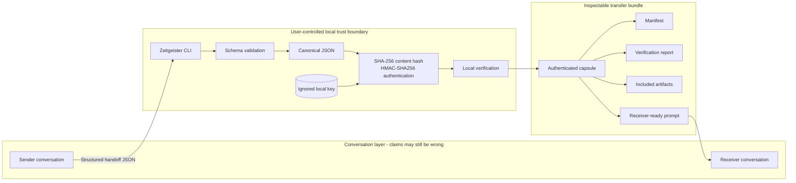
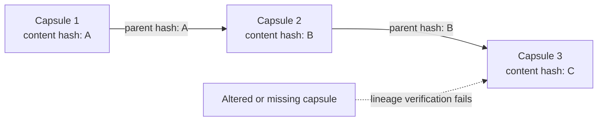
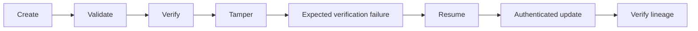

# Zeitgeister AI Capsule

Every AI conversation begins with an illusion.

It remembers.

Until it does not.

A new agent enters the room holding a summary of what happened. It may know the conclusion. It does not know what was observed, what was assumed, which decision survived an argument at two in the morning, or which fact merely sounded real long enough to become policy.

The work continues anyway.

That is the dangerous part.

**Zeitgeister** is a zero-dependency Python CLI for moving deliberate, inspectable context between AI agents. It captures a project goal, ethos, constraints, decisions, rationales, blockers, next steps, evidence status, artifacts, and provenance as deterministic canonical JSON.

Then it does something ordinary and essential: it checks the bytes.

Zeitgeister calculates a SHA-256 content hash, authenticates the capsule with HMAC-SHA256 under a local secret key, verifies the result, and renders a receiver-ready prompt for the next agent.

It works with GPT/ChatGPT, Gemini, Claude, Grok, Qwen, Kimi, local models, future text-capable systems, and human collaborators. Those names are labels, not integrations. Zeitgeister needs no provider SDK, model API key, plugin, cloud account, or Codex intermediary.

> **Trust model, without theater:** Zeitgeister provides local authentication and change detection to people who possess the same local key. It does not encrypt the capsule, make it immutable, establish factual truth, or prove third-party authorship. Never share or commit the signing key.

## One consequential design decision

We rejected invisible conversational memory in favor of authenticated, inspectable capsules.

Why?

Because continuity without provenance can reproduce a misunderstanding with increasing confidence.

Invisible memory is convenient. It is also difficult to interrogate. The user cannot reliably see its boundary, compare its exact contents, or discover which inference survived the crossing between conversations.

Zeitgeister makes the handoff physical.

Open it.

Read it.

Compare it.

Verify it.

See the confirmed decisions. See the unresolved claims. See the missing artifacts. See why one road was taken and which roads remain unexplored.

Here, "signed" has a deliberately narrow meaning: authenticated using HMAC-SHA256 and a user-controlled local shared secret.

It is not a public-key signature. It does not prove that a particular person, company, or AI provider wrote the capsule. That limitation is not hidden in the basement. It stands at the front door.

A tool becomes more trustworthy when it says exactly where its certainty ends.

## Architecture



The conversation layer remains epistemically dangerous: an AI can still be wrong.

The local trust boundary answers a narrower question:

> Is this the same authenticated content that the local user approved and transferred?

The authenticated payload includes every top-level capsule field except `integrity`. Zeitgeister serializes the payload as UTF-8 JSON with sorted keys, compact separators, and no NaN values.

SHA-256 detects content changes.

HMAC-SHA256 authenticates the same bytes using the local key.

When a capsule is updated, Zeitgeister verifies its parent first and records the parent content hash. The result is an inspectable lineage rather than a fog of inherited context.



## What a transfer contains

The recommended `transfer` command produces a self-describing bundle:

| File | Purpose |
| --- | --- |
| `input.json` | Normalized content returned by the sending agent |
| `capsule.json` | Canonical, locally authenticated capsule |
| `capsule.sig` | Non-secret HMAC metadata; the key is never included |
| `manifest.json` | File paths, sizes, and SHA-256 hashes |
| `verification-report.json` | Verification results, warnings, and trust limitations |
| `receiver-prompt.txt` | The exact text given to the receiving agent |
| `transfer-summary.txt` | Short human-readable transfer status |
| `artifacts/` | Only files physically supplied through `--artifact` |

A filename mentioned in conversation is not an artifact.

A URL pointing toward a file is not an artifact.

A model saying that an image was transferred does not make the image appear.

Zeitgeister marks that difference explicitly.

## Installation

Requirements:

- Python 3.10 or newer
- Git
- No third-party Python packages

```sh
git clone https://github.com/dmo-07xD/zeitgeister-ai-capsule.git
cd zeitgeister-ai-capsule
python3 -m zeitgeister --help
```

No package installation is required.

Local keys belong in the ignored `local-state/` directory. Generated transfers belong in the ignored `generated-capsules/` directory.

They remain local. They stay out of Git.

## The 60-second test

From a clean checkout, run:

```sh
python3 -m zeitgeister transfer \
  --from "Example Sender" \
  --to "Example Receiver" \
  --input examples/inter-agent-handoff-input.json \
  --key local-state/quickstart.key \
  --output-dir generated-capsules \
  --force
```

Then independently verify the capsule and render its receiving prompt:

```sh
python3 -m zeitgeister receiver-prompt \
  generated-capsules/example-sender-to-example-receiver/capsule.json \
  --key local-state/quickstart.key \
  --to "Example Receiver"
```

The first command:

1. validates the sample input;
2. generates a secure local key if necessary;
3. creates the capsule;
4. builds the transfer bundle;
5. checks its SHA-256 hash;
6. verifies its HMAC-SHA256 authentication.

The second command reloads the capsule, requires the existing key, verifies it again, and prints the receiver-ready prompt.

Run the automated test suite with:

```sh
python3 -m unittest discover -s tests -v
```

## What success looks like

Capsule IDs, timestamps, and hashes will vary. A successful transfer resembles this:

```text
Verified: SHA-256 and HMAC-SHA256 match (content 8d46f0c9a7b1…).

Transfer ready. Paste this file into Example Receiver:
/path/to/zeitgeister-ai-capsule/generated-capsules/example-sender-to-example-receiver/receiver-prompt.txt

Bundle:
/path/to/zeitgeister-ai-capsule/generated-capsules/example-sender-to-example-receiver

The signing key stayed local and was not displayed or bundled.
```

The receiver does not inherit a mysterious whisper. It receives an explicit brief:

```text
# Zeitgeister handoff

## Goal
Continue a research task from one AI chat to another without losing verified context.

## Confirmed decisions
...

## Claims and evidence status
...

## Missing or included artifacts
...

## Sources and provenance
...

## Action requested
...

## Trust scope
...
```

## Simplest guided transfer

On macOS, a single command manages the browser-to-browser workflow:

```sh
python3 -m zeitgeister guided-transfer \
  --from GPT \
  --to Qwen \
  --key local-state/gpt-to-qwen.key
```

Terminal then guides the human through four actions:

1. Paste the copied sender instruction into GPT.
2. Send it and copy the complete GPT response.
3. Return to Terminal and press Return.
4. Paste the verified receiver prompt into Qwen.

That is the whole crossing.

To use different agents, change only the labels and key filename:

```sh
python3 -m zeitgeister guided-transfer \
  --from "SENDER" \
  --to "RECEIVER" \
  --key local-state/sender-to-receiver.key
```

Confirmed project walkthroughs include:

| Transfer | Command |
| --- | --- |
| GPT to Qwen | `python3 -m zeitgeister guided-transfer --from GPT --to Qwen --key local-state/gpt-to-qwen.key` |
| Grok to Kimi | `python3 -m zeitgeister guided-transfer --from Grok --to Kimi --key local-state/grok-to-kimi.key` |

These successful sessions demonstrate the user-controlled workflow. They do not promise that every provider browser interface will remain unchanged forever. Nothing involving browser interfaces deserves that kind of optimism.

Use `--force` only when replacement of an existing transfer bundle is intentional.

## Manual clipboard workflow

Suppose the conversation must move from GPT to Kimi.

First, copy the sender instruction:

```sh
python3 -m zeitgeister sender-prompt \
  --from GPT \
  --to Kimi \
  --copy
```

Paste it into GPT. Send it. Copy the complete GPT JSON response.

Then run:

```sh
python3 -m zeitgeister transfer \
  --from GPT \
  --to Kimi \
  --input-clipboard \
  --key local-state/gpt-to-kimi.key \
  --output-dir generated-capsules \
  --copy-prompt
```

Zeitgeister reads the clipboard, locates one complete handoff object, validates it, authenticates it, creates the bundle, verifies the capsule, and replaces the clipboard with the Kimi-ready prompt.

Paste that prompt into Kimi.

The clipboard reader accepts:

- clean JSON;
- JSON inside a Markdown code fence;
- one JSON object surrounded by short explanatory prose;
- common invisible clipboard characters.

It refuses multiple distinct handoff objects because ambiguity is not continuity. It is a coin toss wearing a necktie.

Replace the sender and receiver labels to use Gemini, Claude, Grok, Qwen, Kimi, GPT, a local model, or another text-capable agent. The file-based cross-platform workflow, reverse handoffs, strict mode, and attachment handling are documented in [INTER_AGENT_GUIDE.md](INTER_AGENT_GUIDE.md).

## Commands

| Command | Purpose |
| --- | --- |
| `guided-transfer --from GPT --to Qwen --key KEY` | Walk through a complete interactive browser-to-browser transfer |
| `sender-prompt --from GPT --to Kimi [--copy]` | Generate the structured instruction for the sending agent |
| `transfer --from GPT --to Kimi --input INPUT --key KEY` | Validate, authenticate, verify, and package a handoff |
| `receiver-prompt CAPSULE --key KEY --to Kimi` | Reverify a capsule before producing the receiving prompt |
| `create --input CONTENT.json --output CAPSULE.json` | Create and authenticate a root capsule |
| `validate CAPSULE.json` | Check capsule structure without using a key |
| `verify CAPSULE.json` | Verify structure, content hash, key identity, and HMAC |
| `resume CAPSULE.json --format prompt` | Render an authenticated capsule as an agent-ready prompt |
| `resume CAPSULE.json --format json` | Export the complete verified capsule as JSON |
| `update CAPSULE.json --output NEXT.json` | Verify a parent and create a linked successor |
| `verify-lineage FIRST.json NEXT.json ...` | Authenticate a sequence and check its parent hashes |
| `handoff ...` | Support the earlier flat-file handoff workflow |

`transfer` also supports `--artifact`, `--dry-run`, `--strict`, `--fail-on-missing-artifacts`, `--fail-on-unconfirmed-sources`, and guarded `--force` replacement.

## Capsule structure

The sender-facing schema is [schema/zeitgeister-input.schema.json](schema/zeitgeister-input.schema.json). The authenticated output schema is [schema/zeitgeister-capsule.schema.json](schema/zeitgeister-capsule.schema.json).

Every capsule records:

- the project goal;
- the project ethos;
- constraints;
- decisions with rationales;
- blockers;
- next steps;
- structured claims and their evidence status;
- artifacts and their transfer status;
- provenance metadata;
- UTC creation and update timestamps;
- a parent content hash;
- SHA-256 and HMAC-SHA256 integrity metadata.

Claims can be marked:

- `confirmed`
- `unconfirmed`
- `inferred`
- `disputed`

Artifacts can be marked:

- `included`
- `missing`
- `external`

An artifact becomes `included` only when the local command receives the physical file through `--artifact`, copies its bytes into the bundle, and records its SHA-256 hash.

The model does not get to declare matter into existence.

## Guided demonstration

```sh
python3 demo.py --guided
```

The demonstration uses fictional, non-sensitive Political Economy country-quarter data. In under three minutes, it shows:



The temporary signing key is never displayed and is never written into the repository.

For reproducible screenshots, run the guided demo and capture the creation, verified resume, tamper failure, and lineage success stages. Preserve the supplied `Zeitgeister logo.png` and `Zeitgeister thumbnail.png` for the Devpost listing.

## Testing

```sh
python3 -m unittest discover -s tests -v
python3 demo.py --guided
python3 -m zeitgeister --help
python3 -m zeitgeister transfer --help
```

The suite contains 42 unit and integration tests.

It tests canonical serialization, key permissions, verification, malformed input, fenced JSON, prose-wrapped JSON, invisible clipboard characters, ambiguous-object refusal, structured claims, artifact hashing, dry runs, strict failures, Git-ignore protection, tampering, missing keys, wrong keys, guarded updates, prompt rendering, transfer manifests, overwrite protection, lineage, and every CLI command.

The machine does not care about the pitch.

It wants proof.

## Limitations

Zeitgeister is intentionally narrow.

- **It is not encryption.** Capsule text and bundled artifacts remain readable.
- **It is not immutability.** Files can be changed or deleted. Verification can reveal authenticated-content changes.
- **It is not public authorship proof.** HMAC proves possession of a shared key, not the identity of a person, model, or provider.
- **It is not a factual oracle.** An authenticated falsehood remains a falsehood.
- **It cannot survive key compromise.** Anyone holding the key can create capsules that verify under that key.
- **It does not authenticate inside ordinary receiver chats.** The user-controlled CLI verifies the capsule before export.
- **It does not automatically transfer mentioned files.** Physical artifacts must be supplied explicitly.
- **It cannot guarantee model obedience.** A receiving AI can still misunderstand or ignore the prompt.
- **Its clipboard convenience is macOS-specific.** File-based transfers remain portable.

These are not footnotes to be buried after the applause.

They are the perimeter.

## How Codex and GPT-5.6 were used

The project began with a question:

What survives when a conversation ends?

Not endless memory. Not omniscience. Something smaller. Something inspectable.

Accountable memory.

Codex, using GPT-5.6, worked inside the repository as the implementation collaborator. It inspected the files, converted the capsule concept into a Python standard-library CLI, implemented deterministic serialization and local authentication, built the demonstration, documented the schemas, and expanded the test suite.

The human developer set the objective, defended the project ethos, reviewed its claims, chose the local-trust boundary, tested the workflows, and decided what could honestly be said.

Then reality entered the laboratory.

Browser agents said they could not access the ignored local key. A multiline JSON paste left the shell trapped at a continuation prompt. One model carefully explained a command instead of producing the requested handoff. Source URLs crossed between agents while the image they described disappeared somewhere behind them. A receiver confused authenticated transport with factual truth.

Good.

Those failures gave the project its final shape.

`sender-prompt` asks the sending agent only for content it can actually produce.

`transfer` performs the local cryptographic work.

Clipboard mode removes the dangerous multiline shell paste.

Structured claims separate confirmation from inference.

Artifact states distinguish a transferred file from a file merely remembered by name.

The manifest and verification report leave tracks behind the machine.

GPT-5.6 was most useful at the border between code and claim. It helped distinguish hashing from authentication, authentication from encryption, lineage from immutability, and local-key possession from third-party authorship.

It proposed.

The tests answered.

Forty-two tests now stand between the product and an easy illusion.

Zeitgeister does not ask an AI to become the unquestioned authority on its own memory.

It gives the user something better:

An object that can survive the journey.

An object that can be opened.

An object that can be questioned.

## License

MIT. See [LICENSE](LICENSE).
