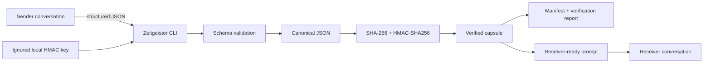

# Zeitgeister AI Capsule

A conversation can appear continuous until the moment it forgets. Then the next agent inherits a summary without knowing what was observed, what was assumed, or why a decision was made. The failure is quiet. The work continues. The error gains confidence.

Zeitgeister is a zero-dependency Python CLI for portable AI-agent handoffs. It turns a project’s goal, ethos, constraints, decisions, blockers, next steps, evidence status, artifacts, and provenance into deterministic canonical JSON. It adds a SHA-256 content hash and HMAC-SHA256 local authentication, verifies the result, and renders a receiver-ready prompt.

It works between GPT/ChatGPT, Gemini, Claude, Grok, Qwen, Kimi, local models, future text-capable agents, and human collaborators. Provider names are labels, not integrations. No model SDK, provider API key, plugin, or Codex intermediary is required.

> **Trust model, plainly:** Zeitgeister provides local authentication and edit detection to holders of the same secret key. It does not encrypt content, make records immutable, establish factual truth, or prove authorship to a third party. Never share or commit the signing key.

## One consequential design decision

We rejected invisible conversational memory in favor of signed, inspectable capsules because continuity without provenance can reproduce misunderstandings with increasing confidence.

Invisible memory is convenient, but the user cannot reliably inspect its boundary, compare its bytes, or determine which inference survived the journey. Zeitgeister makes the handoff an object. You can open it. You can test it. You can see the sources, the unresolved claims, the missing artifacts, and the reason behind each recorded decision.

Here, “signed” means authenticated with HMAC-SHA256 under a user-controlled local shared secret. It is not a public-key signature and does not provide independent authorship verification. That narrow claim is deliberate. The tool becomes stronger by saying exactly where its certainty ends.

## Architecture



The authenticated payload contains every top-level capsule field except `integrity`. Zeitgeister serializes it as UTF-8 JSON with sorted keys, compact separators, and no NaN values. SHA-256 detects content changes. HMAC-SHA256 authenticates the same bytes with the local key. Updates verify their parent first and record the parent content hash, producing an inspectable lineage.

The preferred `transfer` command creates a bundle containing:

- `input.json` — normalized sender content;
- `capsule.json` — canonical locally authenticated capsule;
- `capsule.sig` — non-secret HMAC metadata, never the key;
- `manifest.json` — file paths, sizes, and SHA-256 hashes;
- `verification-report.json` — verification result, warnings, and trust scope;
- `receiver-prompt.txt` — the text given to the next agent;
- `transfer-summary.txt` — concise human-readable status;
- `artifacts/` — only files physically supplied with `--artifact`.

## Installation

Requirements: Python 3.10+ and Git. The core implementation uses only the Python standard library.

```sh
git clone https://github.com/dmo-07xD/zeitgeister-ai-capsule.git
cd zeitgeister-ai-capsule
python3 -m zeitgeister --help
```

No package installation is required. Project-local keys belong under the ignored `local-state/` directory. Generated handoffs belong under the ignored `generated-capsules/` directory.

## 60-second test path

From a clean checkout, run these two commands:

```sh
python3 -m zeitgeister transfer --from "Example Sender" --to "Example Receiver" --input examples/inter-agent-handoff-input.json --key local-state/quickstart.key --output-dir generated-capsules --force
python3 -m zeitgeister receiver-prompt generated-capsules/example-sender-to-example-receiver/capsule.json --key local-state/quickstart.key --to "Example Receiver"
```

The first command validates the sample, generates the local key if needed, creates the capsule and bundle, then verifies its SHA-256 hash and HMAC. The second command independently reloads the capsule, requires the existing key, verifies it again, and prints the receiver prompt.

For the automated proof:

```sh
python3 -m unittest discover -s tests -v
```

## Sample output

The exact hash changes because a new capsule ID and timestamp are created, but a successful transfer looks like this:

```text
Verified: SHA-256 and HMAC-SHA256 match (content 8d46f0c9a7b1…).
Transfer ready. Paste this file into Example Receiver:
/path/to/zeitgeister-ai-capsule/generated-capsules/example-sender-to-example-receiver/receiver-prompt.txt
Bundle: /path/to/zeitgeister-ai-capsule/generated-capsules/example-sender-to-example-receiver
The signing key stayed local and was not displayed or bundled.
```

The rendered prompt begins with visible continuity rather than hidden state:

```text
# Zeitgeister handoff

## Goal
Continue a research task from one AI chat to another without losing verified context.

## Claims and evidence status
...

## Artifact transfer status
...

## Receiver acknowledgement
Before doing substantive work, briefly state the preserved goal,
confirmed decisions, unresolved claims, missing artifacts, and first action.
```

## Simplest guided transfer

On macOS, one command walks through the whole browser-to-browser handoff:

```sh
python3 -m zeitgeister guided-transfer --from GPT --to Qwen --key local-state/gpt-to-qwen.key
```

Zeitgeister copies the sender instruction and pauses. Follow the numbered Terminal directions: paste into GPT, copy GPT's completed response, return to Terminal, and press Return. Zeitgeister then finds the handoff object, validates and authenticates it, builds the transfer bundle, and copies the verified Qwen prompt. Paste once more into Qwen.

Use `--force` only when you intentionally want to replace an existing generated GPT-to-Qwen bundle.

The sender and receiver names are ordinary labels. Use this generic shape:

```sh
python3 -m zeitgeister guided-transfer --from "SENDER" --to "RECEIVER" --key local-state/sender-to-receiver.key
```

Two browser-to-browser combinations were exercised successfully during the project walkthrough:

| Transfer | Exact command |
| --- | --- |
| GPT to Qwen | `python3 -m zeitgeister guided-transfer --from GPT --to Qwen --key local-state/gpt-to-qwen.key` |
| Grok to Kimi | `python3 -m zeitgeister guided-transfer --from Grok --to Kimi --key local-state/grok-to-kimi.key` |

This confirms the user-controlled workflow for those sessions; it is not a claim that provider interfaces will never change.

## Manual GPT-to-Kimi clipboard workflow

On macOS, Terminal can move the text through the clipboard without interactive multiline input.

1. Copy the exact sender instruction:

   ```sh
   python3 -m zeitgeister sender-prompt --from GPT --to Kimi --copy
   ```

2. Paste it into the GPT conversation, send it, and copy GPT’s complete JSON response.

3. Create, authenticate, verify, bundle, and copy the receiver prompt:

   ```sh
   python3 -m zeitgeister transfer --from GPT --to Kimi --input-clipboard --key local-state/gpt-to-kimi.key --output-dir generated-capsules --copy-prompt
   ```

   The clipboard reader automatically finds one complete Zeitgeister object inside common invisible markers, a Markdown code fence, or brief model prose. If the clipboard still contains the Terminal confirmation or sender template, the error names that exact mistake and tells you what to copy next.

4. Paste into Kimi and send.

Replace the sender and receiver labels to use Gemini, Claude, Grok, Qwen, Kimi, GPT, a local model, or another text-capable agent. The file-based cross-platform workflow, reverse handoffs, strict mode, and attachment handling are documented in [INTER_AGENT_GUIDE.md](INTER_AGENT_GUIDE.md).

## Commands

| Command | Purpose |
| --- | --- |
| `guided-transfer --from GPT --to Qwen --key KEY` | Guide the complete interactive clipboard transfer with one Terminal command. |
| `sender-prompt --from GPT --to Kimi [--copy]` | Produce the schema-constrained instruction for the sender. |
| `transfer --from GPT --to Kimi --input INPUT --key KEY` | Validate, authenticate, verify, and build a self-describing transfer bundle. |
| `receiver-prompt CAPSULE --key KEY --to Kimi` | Re-verify a capsule before rendering or copying its receiver prompt. |
| `create --input CONTENT.json --output CAPSULE.json` | Create and locally authenticate a root capsule. |
| `validate CAPSULE.json` | Check capsule structure without using a key. |
| `verify CAPSULE.json` | Verify structure, content hash, key identity, and HMAC. |
| `resume CAPSULE.json --format prompt` | Verify and render an agent-ready prompt. `--format json` exports verified JSON. |
| `update CAPSULE.json --output NEXT.json` | Verify the parent and create a linked successor. |
| `verify-lineage FIRST.json NEXT.json ...` | Authenticate capsules and verify their parent-hash sequence. |
| `handoff ...` | Preserve compatibility with the earlier flat-file export workflow. |

`transfer` also supports `--artifact`, `--dry-run`, `--strict`, `--fail-on-missing-artifacts`, `--fail-on-unconfirmed-sources`, and guarded `--force` replacement.

## Capsule structure

The sender-facing schema is [schema/zeitgeister-input.schema.json](schema/zeitgeister-input.schema.json). The authenticated output schema is [schema/zeitgeister-capsule.schema.json](schema/zeitgeister-capsule.schema.json).

Every new capsule records:

- project goal and ethos;
- constraints;
- decisions with rationales;
- blockers and next steps;
- claims marked `confirmed`, `unconfirmed`, `inferred`, or `disputed`, with source references;
- artifacts marked `included`, `missing`, or `external`;
- provenance metadata;
- UTC creation and update timestamps;
- parent content hash;
- SHA-256 and HMAC-SHA256 integrity metadata.

An artifact cannot become `included` merely because an AI says it was transferred. The local command must receive the physical file with `--artifact`; it then copies the bytes into the bundle and records their SHA-256 hash.

## Guided demonstration

```sh
python3 demo.py --guided
```

The demonstration uses a fictional, non-sensitive Political Economy country-quarter workflow. It shows creation, validation, verification, resume, deliberate tampering and failed verification, authenticated update, and lineage verification. The temporary key is never displayed or written to the repository.

For reproducible screenshots, run the guided demo and capture the create, verified resume, tamper failure, and lineage success stages. Preserve the supplied `Zeitgeister logo.png` and `Zeitgeister thumbnail.png` for the Devpost listing.

## Testing

```sh
python3 -m unittest discover -s tests -v
python3 demo.py --guided
python3 -m zeitgeister --help
python3 -m zeitgeister transfer --help
```

The suite contains 42 unit and integration tests covering canonical serialization, key permissions, normal verification, malformed, fenced, prose-wrapped, and invisible-character AI input, ambiguous-object refusal, structured claims, artifact validation and hashing, dry runs, strict failures, Git-ignore protection, clipboard transfer, tampering, missing and wrong keys, guarded updates, prompt rendering, transfer manifests, overwrite protection, lineage, and every CLI command.

## Limitations

- **No encryption.** Capsule text and bundled artifacts remain readable.
- **No immutability.** Files can be changed or deleted; verification detects authenticated-content changes when the original key remains trustworthy.
- **No public authorship proof.** HMAC demonstrates possession of a shared local secret, not the identity of a person, model, or provider account.
- **No factual oracle.** A correctly authenticated false claim remains false. Evidence status and source references make uncertainty visible; they do not settle it.
- **No protection after key compromise.** Anyone holding the local key can create capsules that verify under that key.
- **No automatic receiver-side authentication in ordinary web chats.** A receiver without the key cannot independently verify the HMAC. The user-controlled CLI verifies before export.
- **No automatic transfer of mentioned files.** Attachments must be physically supplied with `--artifact`; otherwise they remain `missing` or `external`.
- **No guarantee of model obedience.** The receiver prompt preserves structure and asks for acknowledgement, but a model can still misunderstand or disregard instructions.
- **Clipboard convenience is macOS-specific.** `--copy`, `--input-clipboard`, and `--copy-prompt` use the built-in `pbcopy` and `pbpaste` tools. File-based transfer remains portable.

## How Codex and GPT-5.6 were used

The project began as a question about continuity. Not endless memory. Accountable memory.

Codex, using GPT-5.6, worked inside the repository as the implementation collaborator. It inspected the existing files, turned the capsule concept into a Python standard-library CLI, wrote deterministic serialization and local authentication, built the guided demonstration, documented the schemas, and expanded the test suite. The human developer set the goal, reviewed the claims, chose the local-trust boundary, ran the product, and decided what could honestly be said.

The tool improved through contact with real failure. Browser agents said they could not reach the ignored key. A multiline shell paste left the terminal waiting at a continuation prompt. One model described a command instead of executing the requested intellectual handoff. Source URLs survived while the image they referred to vanished. A receiver mistook locally verified transport for verified truth.

Those failures became features. `sender-prompt` asks an agent only for content it can produce. `transfer` performs the local work in one command. Clipboard mode removes the fragile terminal paste. Structured claims separate confirmation from inference. Artifact states distinguish a file that exists from a file merely named. The manifest and verification report leave tracks in the snow.

GPT-5.6 was most useful where the code met the claim. It helped distinguish hashing from authentication, authentication from encryption, lineage from immutability, and local key possession from third-party authorship. It also helped test hostile and malformed inputs, tighten actionable errors, and keep every provider behind the same model-neutral boundary.

The model proposed. The tests answered. Forty-two of them now stand between the idea and an easy illusion.

Zeitgeister does not ask an AI to be the authority on its own memory. It gives the user an object to inspect when the conversation moves on.

## License

MIT. See [LICENSE](LICENSE).
